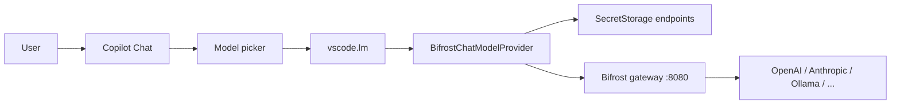
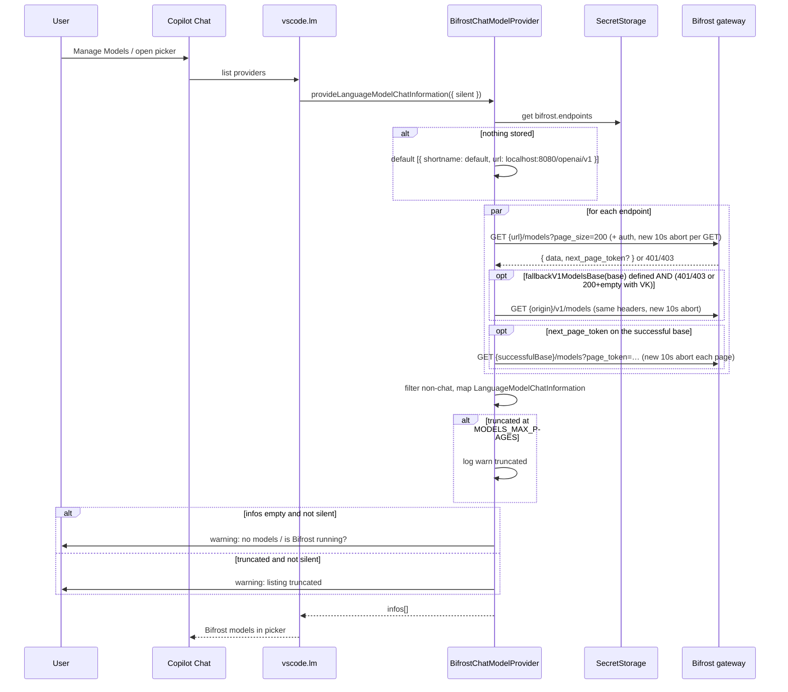

# Bifrost for GitHub Copilot (Unofficial)

| Field                       | Value                                                                                                                                                      |
| --------------------------- | ---------------------------------------------------------------------------------------------------------------------------------------------------------- |
| **Document**                | Software Design Document                                                                                                                                   |
| **Author**                  | TBD                                                                                                                                                        |
| **Date**                    | 2026-08-30                                                                                                                                                 |
| **Status**                  | Draft                                                                                                                                                      |
| **Publisher**               | `jenadounlimited` (locked)                                                                                                                                 |
| **Extension id**            | `jenadounlimited.bifrost-for-github-copilot`                                                                                                               |
| **Marketplace displayName** | Bifrost for GitHub Copilot (Unofficial)                                                                                                                    |
| **Repo**                    | `jenadounlimited/bifrost_for_github_copilot`                                                                                                               |
| **Clone target**            | [lemonade-sdk/lemonade-vscode](https://github.com/lemonade-sdk/lemonade-vscode) v0.0.8 (MIT), pin `6117a3e` (`Fix extension source URL (#22)`, 2026-05-07) |
| **Lineage**                 | Hugging Face [huggingface-vscode-chat](https://github.com/huggingface/huggingface-vscode-chat) → Lemonade → this extension                                 |

---

## Overview

GitHub Copilot Chat in VS Code can consume third-party models through the `LanguageModelChatProvider` API. Bifrost already documents a _manual_ Copilot BYOK path that requires users to hard-code every model into `chatLanguageModels.json`. That does not auto-discover models, does not pick up per-model context/vision metadata, and does not scale across multiple gateways.

This project is a greenfield VS Code extension — **Bifrost for GitHub Copilot (Unofficial)** — that clones the Lemonade-for-Copilot UX for the Bifrost AI gateway. It registers a first-class vendor (`bifrost`) so gateway models appear in Copilot Chat's model picker, auto-discovers them from `GET {base}/models` (default stored base `http://localhost:8080/openai/v1`, so the first request is `/openai/v1/models`; on 401/403, retry `{origin}/v1/models`), streams chat completions (including Copilot Agent tool calls) to `POST {base}/chat/completions`, and stores gateway URLs plus optional virtual keys in VS Code `SecretStorage`.

This is **not** an official Maxim HQ product. Publisher is `jenadounlimited`; Maxim may adopt the repo later. It is a community extension that talks to the existing Bifrost OpenAI-compatible HTTP API. It does not embed, fork, or ship Bifrost itself.

---

## Background & Motivation

### Current state

Bifrost ([maximhq/bifrost](https://github.com/maximhq/bifrost), docs: [docs.getbifrost.ai](https://docs.getbifrost.ai)) is an OpenAI-compatible AI gateway in front of 20+ providers (OpenAI, Anthropic, Bedrock, Vertex, Azure, Groq, Ollama, vLLM, xAI, …). Default local deploy:

```bash
npx -y @maximhq/bifrost
# or
docker run -p 8080:8080 maximhq/bifrost
# UI: http://localhost:8080
```

Chat endpoints (both valid):

```
POST http://localhost:8080/v1/chat/completions
POST http://localhost:8080/openai/v1/chat/completions
```

Model IDs are typically `provider/model`, e.g. `openai/gpt-4o-mini`, `anthropic/claude-sonnet-4-5-20250929`.

Bifrost already documents Copilot BYOK in [GitHub Copilot](https://docs.getbifrost.ai/cli-agents/github-copilot.md):

| Surface              | How it works today                                                                                                            | This extension                      |
| -------------------- | ----------------------------------------------------------------------------------------------------------------------------- | ----------------------------------- |
| Copilot App          | Settings → Model Providers → OpenAI-compatible, base URL `http://localhost:8080/openai/v1/chat/completions`                   | **Out of scope** — already works    |
| Copilot CLI          | `COPILOT_PROVIDER_*` env vars                                                                                                 | **Out of scope** — already works    |
| VS Code Copilot Chat | Custom Endpoint via `chatLanguageModels.json` with **hardcoded per-model entries** (id, url, max tokens, toolCalling, vision) | **This is the pain point we solve** |

The VS Code Custom Endpoint snippet from Bifrost docs is the status quo:

```json
{
  "name": "Bifrost",
  "vendor": "customendpoint",
  "apiKey": "${input:bifrostApiKey}",
  "apiType": "chat-completions",
  "models": [
    {
      "id": "anthropic/claude-sonnet-4-5-20250929",
      "name": "Claude Sonnet 4.5 (Bifrost)",
      "url": "http://localhost:8080/openai/v1/chat/completions",
      "toolCalling": true,
      "vision": true,
      "maxInputTokens": 200000,
      "maxOutputTokens": 8192
    }
  ]
}
```

Pain: every model is static, token limits are guessed, vision/tool flags are hand-set, adding a new provider in the Bifrost dashboard does not update Copilot, and multiple gateways (dev/staging/prod) require duplicated JSON.

### What Lemonade already solved (for a local LLM server)

[Lemonade for GitHub Copilot](https://github.com/lemonade-sdk/lemonade-vscode) (marketplace `lemonade-sdk.lemonade-sdk`, v0.0.8) registers `vscode.lm.registerLanguageModelChatProvider("lemonade", provider)`, fans out `GET /models` to configured endpoints, and streams SSE `chat/completions` including native and text-embedded tool calls so Copilot Agent mode works. Originally based on Hugging Face's `huggingface-vscode-chat`. MIT.

We want that UX, pointed at Bifrost, with Bifrost-specific model metadata, auth, and privacy honesty (Bifrost is a _gateway_, not a local-only inference server).

### Why a Language Model Chat Provider instead of Custom Endpoint JSON

|                        | `chatLanguageModels.json`       | `LanguageModelChatProvider` extension        |
| ---------------------- | ------------------------------- | -------------------------------------------- |
| Model discovery        | Static list                     | Live `GET /models`                           |
| Token limits           | Hand-edited                     | From Bifrost model catalog                   |
| Vision / tools         | Hand-edited                     | From `architecture` / `supported_parameters` |
| Multi-gateway          | Copy-paste groups               | Named endpoints in SecretStorage             |
| Agent tool-call quirks | VS Code's generic OpenAI client | We own SSE + control-token stripping         |
| Install UX             | Edit JSON                       | Marketplace install + Manage command         |

---

## Goals & Non-Goals

### Goals (v1)

1. First-class Copilot Chat language-model provider. Extension display name **Bifrost for GitHub Copilot (Unofficial)**; vendor id `bifrost`.
2. Auto-discover models from Bifrost `GET {base}/models` with pagination.
3. Stream chat + tool calling so Copilot **Agent** mode works (native `delta.tool_calls` _and_ text-embedded control tokens).
4. Manage-provider command for gateway URL + optional virtual key, stored in `SecretStorage`.
5. Multi-gateway endpoints (dev/staging/prod, local + remote) using shortname-prefixed VS Code model IDs.
6. Per-model `maxInputTokens` / `maxOutputTokens` / `imageInput` from `/v1/models` metadata.
7. Filter non-chat models (embeddings, TTS, STT, image-generation, rerank) out of the picker.
8. Connection test in Manage UI; deep-link to the Bifrost dashboard.
9. MIT license with attribution to lemonade-sdk and huggingface-vscode-chat.
10. Zero runtime npm dependencies.

### Non-goals (v1)

- **Not** an official Maxim HQ product, branding, or logo (unless Maxim adopts the repo).
- Copilot App BYOK and Copilot CLI BYOK (already documented by Bifrost).
- Inline code completion / Ghost Text. Lemonade does not do this either; Copilot completions stay on GitHub's infrastructure.
- Registering Bifrost's MCP gateway (`/mcp`) as a VS Code MCP server. Copilot MCP is configured separately; see [Bifrost Copilot MCP docs](https://docs.getbifrost.ai/cli-agents/github-copilot.md#adding-mcp-servers-via-bifrost).
- A second vendor for Bifrost's native Anthropic Messages API (`/anthropic/v1/messages`). Copilot talks to _us_ via the LM provider; we speak OpenAI chat-completions to Bifrost.
- OpenAI Responses API (`/v1/responses`) as a wire format.
- Shipping or managing Bifrost itself (no docker compose, no provider-key wizard).
- Prompt/response logging dashboards, cost UI, or Prometheus from the extension.
- Workspace-scoped endpoints (user-global SecretStorage only, matching Lemonade).
- Authenticating to Bifrost _dashboard_ Basic/OIDC as a second credential layer. When HTTP identity is enabled on inference (`governance.auth_config` / `disable_auth_on_inference: false`), Bifrost consumes `Authorization` for that identity and the virtual key **must** go on `x-bf-vk`. v1 does not collect a dashboard username/password or OIDC token, so those deployments are **unsupported**. `client.enforce_auth_on_inference` (VK-mandatory, no HTTP identity) **is** supported.

---

## Key Decisions

These are the architectural defaults. Product questions in [Open Questions](#open-questions) are **resolved** (user 2026-08-30).

| #    | Decision                                                                                                                                                                                                                                                                                                                                                                        | Rationale                                                                                                                                                                                                                                                                                                                                                                                                                                                         |
| ---- | ------------------------------------------------------------------------------------------------------------------------------------------------------------------------------------------------------------------------------------------------------------------------------------------------------------------------------------------------------------------------------- | ----------------------------------------------------------------------------------------------------------------------------------------------------------------------------------------------------------------------------------------------------------------------------------------------------------------------------------------------------------------------------------------------------------------------------------------------------------------- |
| KD1  | **Publisher:** `jenadounlimited`. **Extension id:** `jenadounlimited.bifrost-for-github-copilot`. Vendor id: `bifrost`.                                                                                                                                                                                                                                                         | Community / unofficial. Maxim may adopt later; do not wait.                                                                                                                                                                                                                                                                                                                                                                                                       |
| KD2  | **Display name:** `Bifrost for GitHub Copilot (Unofficial)`. Original icon. README not-affiliated disclaimer. Do not wait for Maxim assets.                                                                                                                                                                                                                                     | Puts unofficial in the marketplace name so it cannot be mistaken for a Maxim product.                                                                                                                                                                                                                                                                                                                                                                             |
| KD3  | **Default API base:** `http://localhost:8080/openai/v1`.                                                                                                                                                                                                                                                                                                                        | Confirmed. Matches Bifrost's Copilot docs, OpenAI SDK drop-in (`base_url=…/openai` + `/v1`), and Copilot App's `…/openai/v1/chat/completions`. `/v1` also works; we accept and normalize it.                                                                                                                                                                                                                                                                      |
| KD4  | **No dummy API key.** If no virtual key is stored, omit `Authorization` and `x-bf-vk` entirely.                                                                                                                                                                                                                                                                                 | Lemonade always sends `Bearer lemonade`. Bifrost may reject unknown keys when governance/auth is on. Local unauthenticated Bifrost accepts no-auth requests.                                                                                                                                                                                                                                                                                                      |
| KD5  | **Default authMode is `"auto"`**, not `"both"`. `sk-bf-*` → `Authorization: Bearer` only; legacy keys without that prefix → `x-bf-vk` only. `"both"` is an explicit opt-in.                                                                                                                                                                                                     | Bifrost OpenAI SDK docs: sending the VK in both `api_key` and `x-bf-vk` requires `dual_credential_conflict_behavior: prefer_vk`. The public default of that setting is unconfirmed, so dual headers must not be the v1 default. `enforce_auth_on_inference` makes a **virtual key** mandatory; it does **not** consume `Authorization` for HTTP identity. HTTP Basic/OIDC identity is a different knob (`disable_auth_on_inference: false`) and is a v1 non-goal. |
| KD6  | **VS Code model id = `{shortname}/{bifrostModelId}`**, decoded with **first slash only**.                                                                                                                                                                                                                                                                                       | Bifrost ids already contain slashes (`openai/gpt-4o-mini`). `indexOf("/")` still works: `prod/openai/gpt-4o-mini` → shortname `prod`, model `openai/gpt-4o-mini`.                                                                                                                                                                                                                                                                                                 |
| KD7  | **Per-model token limits** from `max_input_tokens` / `max_output_tokens` / `context_length`. Fallbacks: context 128000, max output 16000.                                                                                                                                                                                                                                       | Lemonade uses a global `LEMONADE_CTX_SIZE`. Bifrost's catalog is richer; do not invent `BIFROST_CTX_SIZE`.                                                                                                                                                                                                                                                                                                                                                        |
| KD8  | **`capabilities.imageInput`** from `architecture.input_modalities` containing `image` (case-insensitive), else false.                                                                                                                                                                                                                                                           | Lemonade hard-codes `imageInput: false`.                                                                                                                                                                                                                                                                                                                                                                                                                          |
| KD9  | **`capabilities.toolCalling`:** `true` unless `supported_parameters` is present and contains neither `tools`, `tool_choice`, nor `functions`. When that field is absent, tooltip notes **"tool calling assumed"** — we do not claim catalog proof.                                                                                                                              | Copilot Agent needs tools. Many Bifrost catalog rows omit `supported_parameters`.                                                                                                                                                                                                                                                                                                                                                                                 |
| KD10 | **Filter non-chat models** via `supported_methods`, `architecture.modality` / `output_modalities`, and id/name heuristics. When unsure, **keep** the model.                                                                                                                                                                                                                     | A 3k-row catalog includes embeddings, TTS, image-gen, rerank. Copilot picker is chat-only.                                                                                                                                                                                                                                                                                                                                                                        |
| KD11 | **Paginate** `GET /models?page_size=200` following `next_page_token`, max 20 pages. `fetchAllModels` returns `{ models, truncated, pages, listBase }` — it does **not** take `silent` and must **not** call `showWarningMessage`. The provider logs always and warns only when `!options.silent && truncated`.                                                                  | Lemonade does not paginate. Bifrost documents `page_size` / `page_token`. A silent-listing modal would violate the LM provider `silent` contract.                                                                                                                                                                                                                                                                                                                 |
| KD12 | **Listing fallback:** if the stored base ends with `/openai/v1` and `GET {base}/models` returns **401 or 403**, retry `{origin}/v1/models` with the same headers and **paginate only on the successful base**. Also retry that fallback on **200 + empty `data` when a virtual key is present** (older keyless-list bugs).                                                      | Matches implementable HTTP status, not a parsed `key_statuses` payload. [#2993](https://github.com/maximhq/bifrost/issues/2993) is still open (`/openai/v1/models` fans out). [#3607](https://github.com/maximhq/bifrost/issues/3607) is **closed** (#3655); empty-list fallback is a version caveat.                                                                                                                                                             |
| KD13 | **Target VS Code `^1.104.0`.** TypeScript, **no runtime npm deps**. Tests via `@vscode/test-cli`.                                                                                                                                                                                                                                                                               | Same floor as Lemonade; that is when `LanguageModelChatProvider` shipped.                                                                                                                                                                                                                                                                                                                                                                                         |
| KD14 | **MIT** + `NOTICE.md` attributing huggingface-vscode-chat **and** lemonade-vscode. Re-implement the pattern; do not copy Lemonade branding or assets.                                                                                                                                                                                                                           | License-clean lineage.                                                                                                                                                                                                                                                                                                                                                                                                                                            |
| KD15 | **HTTP allowed for loopback** (`localhost`, `127.0.0.1`, `::1`). Warn (do not block) on `http://` for any other host.                                                                                                                                                                                                                                                           | Local Bifrost is HTTP by default. Cleartext VKs to a remote host is a real risk.                                                                                                                                                                                                                                                                                                                                                                                  |
| KD16 | **Chat: no read timeout** besides `CancellationToken` → `AbortController` on `fetch` (intentional Lemonade fix; Lemonade only checked the token in the SSE read loop, so a hung TCP never died). **Listing and Manage → Test: 10s abort per HTTP call** via `listingFetch` (new timer for first page, fallback retry, and every `page_token`; always `dispose()` in `finally`). | Agent tool loops can run minutes; a 30s _read_ timeout would kill sessions. A black-hole host must not hang the picker or Test UI forever. One timer for the whole list would abort page 2+ at T+10s.                                                                                                                                                                                                                                                             |
| KD17 | **MCP helper commands: no for v1.** Document the pointer to Bifrost MCP docs in README.                                                                                                                                                                                                                                                                                         | Lemonade also does not register MCP. Copilot already has MCP config.                                                                                                                                                                                                                                                                                                                                                                                              |
| KD18 | **One OpenAI-style vendor only.** No Anthropic Messages vendor in v1.                                                                                                                                                                                                                                                                                                           | Copilot Chat talks to our provider; we translate to OpenAI chat-completions. Dual vendors double test surface.                                                                                                                                                                                                                                                                                                                                                    |
| KD19 | **Streaming parser lives in `src/stream.ts`**, conversion in `src/utils.ts`, listing in `src/models.ts`. Construct a **new parser per request**. Wire `AbortController` to chat `fetch` (Lemonade did not). Do **not** port Lemonade's unused `_chatEndpoints` cache.                                                                                                           | Lemonade's `provider.ts` is 33kB of mixed concerns and holds stream buffers on the singleton. Splitting plus per-request state are the structural improvements; AbortController is the hung-TCP fix.                                                                                                                                                                                                                                                              |
| KD20 | **Do not log prompts, completions, or virtual keys.** Output channel logs endpoint shortname, model id, status, duration, estimated tokens.                                                                                                                                                                                                                                     | Gateway may forward to OpenAI/Anthropic; the extension must not add a second leak.                                                                                                                                                                                                                                                                                                                                                                                |

---

## Proposed Design

### User flow

1. User runs Bifrost (`npx -y @maximhq/bifrost` or Docker on port 8080) and configures providers / optional virtual keys in `http://localhost:8080`.
2. Install **Bifrost for GitHub Copilot (Unofficial)**.
3. Open Copilot Chat → model picker → **Manage Models…** → select **Bifrost (Unofficial)**.
4. Pick a discovered model (e.g. `anthropic/claude-sonnet-4-5`).
5. Chat, including Copilot Agent mode with tool calling.

Optional: Command Palette → **Manage Bifrost Provider** to add/edit/remove gateways, set a virtual key, test connectivity, or open the dashboard.



This is **not** "everything stays on your machine." If Bifrost is configured with cloud providers, prompts leave the box. See [Security & Privacy](#security--privacy-considerations).

### Exact file tree

```
bifrost_for_github_copilot/
├── .github/workflows/ci.yml
├── .vscode/
│   ├── launch.json
│   └── tasks.json
├── assets/
│   └── icon.png                 # original simple icon, not Maxim branding
├── src/
│   ├── extension.ts             # activate, register provider, commands
│   ├── provider.ts              # LanguageModelChatProvider
│   ├── manage.ts                # QuickPick endpoint CRUD + test + dashboard
│   ├── models.ts                # fetch, paginate, filter, map to VS Code info
│   ├── auth.ts                  # header construction, URL normalize, localhost check
│   ├── stream.ts                # SSE reader, native + text-embedded tool calls
│   ├── utils.ts                 # convertMessages, convertTools, validateRequest, sanitizeSchema
│   ├── types.ts                 # Bifrost + OpenAI-compat types
│   ├── constants.ts             # vendor, secret keys, defaults
│   ├── log.ts                   # OutputChannel helper (redacting)
│   ├── vscode.d.ts              # generated by @vscode/dts; commit it (Lemonade pattern); not hand-edited
│   └── test/
│       ├── provider.test.ts
│       ├── models.test.ts
│       ├── auth.test.ts
│       ├── stream.test.ts
│       ├── utils.test.ts
│       ├── manage.test.ts
│       └── fixtures/
│           └── sse.ts
├── .gitignore
├── .prettierignore
├── .prettierrc
├── .vscodeignore
├── .vscode-test.mjs
├── eslint.config.mjs
├── LICENSE                      # MIT
├── NOTICE.md                    # Hugging Face + Lemonade attribution
├── README.md
├── package.json                 # "packageManager": pnpm; download-api / postinstall scripts
├── pnpm-lock.yaml               # pnpm only — do not check in package-lock.json
└── tsconfig.json
```

No runtime `dependencies`. Package manager is **pnpm** (same as Lemonade). DevDependencies: `typescript`, `eslint`, `prettier`, `@types/node`, `@types/mocha`, `@types/vscode` (`^1.104.0`, matching engines), `@vscode/dts`, `@vscode/test-cli`, `@vscode/test-electron`.

`package.json` scripts (Lemonade-equivalent; required so `src/vscode.d.ts` exists in CI):

```json
{
  "packageManager": "pnpm@8.15.4",
  "scripts": {
    "vscode:prepublish": "pnpm run compile",
    "download-api": "dts dev",
    "postdownload-api": "dts main",
    "postinstall": "pnpm run download-api",
    "compile": "tsc -p ./",
    "lint": "eslint",
    "format": "prettier --write .",
    "watch": "tsc -watch -p ./",
    "test": "pnpm run compile && vscode-test"
  }
}
```

`@vscode/dts` generates `src/vscode.d.ts` (proposed + current LM provider types: `prepare*`/`provide*`, `LanguageModelThinkingPart`, `LanguageModelDataPart`). **Commit it** (Lemonade v0.0.8 does — clones then compile without network). Do not hand-edit it. CI still runs `pnpm install` / `postinstall` so the file stays current. Official sample only implements `provideLanguageModelChatInformation`; we still implement both names (Lemonade; API-churn risk).

### package.json contributions

```json
{
  "name": "bifrost-for-github-copilot",
  "publisher": "jenadounlimited",
  "displayName": "Bifrost for GitHub Copilot (Unofficial)",
  "description": "Use the Bifrost AI gateway as a GitHub Copilot Chat language model provider",
  "version": "0.0.1",
  "license": "MIT",
  "engines": { "vscode": "^1.104.0" },
  "categories": ["AI", "Chat"],
  "main": "./out/extension.js",
  "contributes": {
    "languageModelChatProviders": [
      {
        "vendor": "bifrost",
        "displayName": "Bifrost (Unofficial)",
        "managementCommand": "bifrost.manage"
      }
    ],
    "commands": [
      {
        "command": "bifrost.manage",
        "title": "Manage Bifrost Provider"
      },
      {
        "command": "bifrost.toggleEphemeralFilter",
        "title": "Toggle Bifrost filter ephemeral data"
      }
    ]
  },
  "dependencies": {}
}
```

`publisher` is locked: `jenadounlimited`. `vendor` is `bifrost` and must match `registerLanguageModelChatProvider("bifrost", …)`. The picker label is `Bifrost (Unofficial)`; the extension marketplace name is `Bifrost for GitHub Copilot (Unofficial)`.

### Mapping table: Lemonade → Bifrost

| Concern           | Lemonade                                 | Bifrost (this extension)                                                                                                                            |
| ----------------- | ---------------------------------------- | --------------------------------------------------------------------------------------------------------------------------------------------------- |
| Vendor id         | `lemonade`                               | `bifrost`                                                                                                                                           |
| Display name      | Lemonade                                 | Bifrost (Unofficial) (picker); extension: Bifrost for GitHub Copilot (Unofficial)                                                                   |
| Manage command    | `lemonade.manage`                        | `bifrost.manage`                                                                                                                                    |
| Ephemeral toggle  | `lemonade.toggleEphemeralFilter`         | `bifrost.toggleEphemeralFilter`                                                                                                                     |
| Default base URL  | `http://localhost:13305/api/v1`          | `http://localhost:8080/openai/v1`                                                                                                                   |
| Default API key   | `"lemonade"` always sent                 | **none** — omit headers if unset                                                                                                                    |
| Auth headers      | `Authorization: Bearer {key}`            | **auto:** `sk-bf-*` → Bearer only; legacy → `x-bf-vk` only. `"both"` opt-in.                                                                        |
| Secret key        | `lemonade.endpoints`                     | `bifrost.endpoints`                                                                                                                                 |
| Endpoint shape    | `{ shortname, url, apiKey? }`            | `{ shortname, url, virtualKey?, authMode? }` (`authMode` omitted = auto)                                                                            |
| Legacy migration  | `lemonade.serverUrl` / `lemonade.apiKey` | none (greenfield; still write a no-op-safe reader)                                                                                                  |
| Model list        | `GET {url}/models`                       | `GET {url}/models?page_size=200` + `next_page_token`; if base is `…/openai/v1` and 401/403 (or 200+empty with VK), paginate on `{origin}/v1/models` |
| Model id on wire  | opaque `Llama-3.2-3B`                    | `provider/model` e.g. `openai/gpt-4o-mini`                                                                                                          |
| VS Code model id  | `{shortname}/{model.id}`                 | same encoding, first-slash split                                                                                                                    |
| Display name      | same as id                               | `normalized_name` \|\| `name` \|\| `id`; prefix shortname if >1 endpoint                                                                            |
| Context / max out | global 128k / 16k (`LEMONADE_CTX_SIZE`)  | per-model from catalog, same numeric fallbacks                                                                                                      |
| `imageInput`      | always false                             | from `architecture.input_modalities`                                                                                                                |
| `toolCalling`     | always true                              | true unless `supported_parameters` contradicts                                                                                                      |
| Chat POST         | `{url}/chat/completions`                 | same relative path                                                                                                                                  |
| User-Agent        | `lemonade-sdk/{ver} VSCode/{ver}`        | `bifrost-for-github-copilot/{ver} VSCode/{ver}`                                                                                                     |
| Family            | `"lemonade"`                             | `"bifrost"`                                                                                                                                         |
| Privacy claim     | "never leaves your machine"              | **Must not claim this** — Bifrost may proxy to cloud APIs                                                                                           |
| Dashboard         | lemonade-server.ai                       | `{origin}` e.g. `http://localhost:8080`                                                                                                             |

### Activation

`src/extension.ts`:

```ts
export function activate(context: vscode.ExtensionContext): void {
  const ext = vscode.extensions.getExtension('jenadounlimited.bifrost-for-github-copilot');
  const extVersion = ext?.packageJSON?.version ?? 'unknown';
  const ua = `bifrost-for-github-copilot/${extVersion} VSCode/${vscode.version}`;

  const log = createLogger();
  const provider = new BifrostChatModelProvider(context.secrets, ua, log);
  context.subscriptions.push(
    vscode.lm.registerLanguageModelChatProvider('bifrost', provider),
    vscode.commands.registerCommand('bifrost.manage', () =>
      manageEndpoints(context.secrets, provider, log),
    ),
    vscode.commands.registerCommand('bifrost.toggleEphemeralFilter', () =>
      toggleEphemeralFilter(context.secrets),
    ),
    log,
  );
}

export function deactivate(): void {}
```

`getExtension("jenadounlimited.bifrost-for-github-copilot")` is locked to `publisher.name`.

Do **not** subscribe to `secrets.onDidChange` and do **not** cache `LanguageModelChatInformation[]` on the provider singleton. After Add/Edit/Remove, rely on the next `provideLanguageModelChatInformation` (picker open / Manage Models). Lemonade stores `_chatEndpoints` and never uses it for routing — do not port that field.

### Constants (`src/constants.ts`)

```ts
export const VENDOR_ID = 'bifrost';
export const ENDPOINTS_SECRET_KEY = 'bifrost.endpoints';
export const EPHEMERAL_FILTER_SECRET_KEY = 'bifrost.filterEphemeralData';

export const DEFAULT_BASE_URL = 'http://localhost:8080/openai/v1';
export const DEFAULT_SHORTNAME = 'default';
export const DEFAULT_MAX_OUTPUT_TOKENS = 16_000;
export const DEFAULT_CONTEXT_LENGTH = 128_000;
export const DEFAULT_AUTH_MODE: BifrostAuthMode = 'auto';
export const LIST_FETCH_TIMEOUT_MS = 10_000; // listing + Manage Test only

export const MODELS_PAGE_SIZE = 200;
export const MODELS_MAX_PAGES = 20;
export const MAX_TOOLS_PER_REQUEST = 128;

export const LOOPBACK_HOSTS = new Set(['localhost', '127.0.0.1', '[::1]', '::1']);
```

### Sequence: activate → list models



Failures on individual endpoints are swallowed (logged at warn). Healthy nodes still appear. This matches Lemonade's fan-out.

### Sequence: chat request → SSE → tool call

```mermaid
sequenceDiagram
  participant Copilot as Copilot Agent
  participant VS as vscode.lm
  participant P as provider.ts
  participant U as utils.ts
  participant ST as stream.ts
  participant G as Bifrost POST /chat/completions

  Copilot->>VS: chat + tools
  VS->>P: provideLanguageModelChatResponse(model, messages, options, progress, token)
  P->>P: new SseChatParser() per request (no singleton buffers)
  P->>P: split model.id on first "/" → shortname, bifrostModelId
  P->>U: convertMessages(messages, filterEphemeral)
  P->>U: validateRequest(messages)
  P->>U: convertTools(options)
  P->>P: estimate tokens; reject if over maxInputTokens
  P->>G: POST {url}/chat/completions stream=true (AbortController ← token)
  G-->>ST: SSE data: {choices[0].delta}
  loop each event
    alt delta.content
      ST->>ST: processTextContent (strip control tokens / parse text-embedded tools)
      ST->>VS: LanguageModelTextPart and/or LanguageModelToolCallPart
    else delta.tool_calls[i]
      ST->>ST: buffer by index; emit when args are valid JSON
      ST->>VS: LanguageModelToolCallPart
    else thinking / reasoning_content
      ST->>VS: LanguageModelThinkingPart (if ctor exists)
    else data: [DONE] or finish_reason stop/tool_calls
      ST->>ST: flush buffers
    end
  end
  Copilot->>Copilot: execute tool, append ToolResultPart, next turn
```

Chat `fetch` is aborted only by `CancellationToken` (no read timeout). Each listing/Test GET uses a **fresh 10s** abort **and** that token (`listingFetch`). On chat abort, the SSE parser must **not** flush incomplete tool JSON.

---

## API / Interface Changes

This is a new extension. The only "API" is the VS Code contribution surface plus the Bifrost HTTP client.

### VS Code `LanguageModelChatProvider`

Implemented by `BifrostChatModelProvider`:

```ts
class BifrostChatModelProvider implements vscode.LanguageModelChatProvider {
  constructor(
    private readonly secrets: vscode.SecretStorage,
    private readonly userAgent: string,
    private readonly log: BifrostLog,
  ) {}

  prepareLanguageModelChatInformation(
    options: { silent: boolean },
    token: vscode.CancellationToken,
  ): Promise<vscode.LanguageModelChatInformation[]>;

  provideLanguageModelChatInformation(
    options: { silent: boolean },
    token: vscode.CancellationToken,
  ): Promise<vscode.LanguageModelChatInformation[]>;
  // delegates to prepareLanguageModelChatInformation
  // (Lemonade implements both; older and newer VS Code hosts call different names)

  provideLanguageModelChatResponse(
    model: vscode.LanguageModelChatInformation,
    messages: readonly vscode.LanguageModelChatMessage[],
    options: vscode.LanguageModelChatRequestHandleOptions,
    progress: vscode.Progress<vscode.LanguageModelResponsePart>,
    token: vscode.CancellationToken,
  ): Promise<void>;

  provideTokenCount(
    model: vscode.LanguageModelChatInformation,
    text: string | vscode.LanguageModelChatMessage,
    token: vscode.CancellationToken,
  ): Promise<number>;
  // chars/4 heuristic; same as Lemonade. Good enough for v1.

  getEndpoints(): Promise<BifrostEndpoint[]>;
}
```

`LanguageModelChatInformation` we advertise:

```ts
{
  id: `${shortname}/${model.id}`,          // unique within vendor
  name: displayName,                       // human-readable
  detail: model.id,                        // raw Bifrost id
  tooltip: [
    `${shortname} · ${endpoint.url}`,
    `context ${maxInput + maxOutput}`,
    model.created ? `created ${model.created}` : undefined,
    toolCallingAssumed ? "tool calling assumed" : undefined,
  ].filter(Boolean).join("\n"),
  family: "bifrost",
  version: "1.0.0",                        // not catalog `created` (that is not a compatibility version)
  maxInputTokens,
  maxOutputTokens,
  capabilities: {
    toolCalling,                           // boolean
    imageInput,                            // boolean
  },
}
```

`toolCallingAssumed` is true when we advertised `toolCalling: true` because `supported_parameters` was absent (KD9).

Response parts we emit:

| Part                                              | When                                                                                                              |
| ------------------------------------------------- | ----------------------------------------------------------------------------------------------------------------- |
| `LanguageModelTextPart`                           | `delta.content` after control-token stripping                                                                     |
| `LanguageModelToolCallPart(id, name, argsObject)` | native `tool_calls` with valid JSON args, or text-embedded `<\|tool_call_begin\|>`…                               |
| `LanguageModelThinkingPart`                       | if `vscode.LanguageModelThinkingPart` exists **and** the chunk has `thinking` / `reasoning_content` / `reasoning` |

### TypeScript interfaces (`src/types.ts`)

```ts
export type BifrostAuthMode = 'auto' | 'bearer' | 'x-bf-vk' | 'both';

export interface BifrostEndpoint {
  shortname: string; // e.g. "default", "prod"
  url: string; // OpenAI-style base, e.g. "http://localhost:8080/openai/v1"
  virtualKey?: string; // sk-bf-* or legacy VK; omit field if empty
  authMode?: BifrostAuthMode; // omitted or "auto" → prefix-based (KD5)
}

export interface BifrostModelArchitecture {
  modality?: string;
  tokenizer?: string;
  instruct_type?: string;
  input_modalities?: string[];
  output_modalities?: string[];
}

export interface BifrostModel {
  id: string; // "openai/gpt-4o-mini"
  object?: string;
  canonical_slug?: string;
  name?: string;
  normalized_name?: string; // "Claude Sonnet 4.5"
  deployment?: string;
  created?: number;
  owned_by?: string;
  context_length?: number;
  max_input_tokens?: number;
  max_output_tokens?: number;
  architecture?: BifrostModelArchitecture;
  supported_parameters?: string[];
  supported_methods?: string[];
  description?: string;
  top_provider?: {
    is_moderated?: boolean;
    context_length?: number;
    max_completion_tokens?: number;
  };
  reasoning?: {
    mandatory?: boolean;
    default_enabled?: boolean;
    supported_efforts?: string[];
    default_effort?: string;
  };
}

export interface BifrostModelsResponse {
  object?: string;
  data?: BifrostModel[];
  next_page_token?: string;
}

/** Result of `fetchAllModels`. No `silent` field — the provider owns UI. */
export interface FetchAllModelsResult {
  models: BifrostModel[];
  truncated: boolean;
  pages: number;
  listBase: string; // base actually used after KD12 fallback
  fallbackUsed: boolean;
}

export type OpenAIChatRole = 'system' | 'user' | 'assistant' | 'tool';

export interface OpenAIToolCall {
  id: string;
  type: 'function';
  function: { name: string; arguments: string };
}

export interface OpenAIFunctionToolDef {
  type: 'function';
  function: { name: string; description?: string; parameters?: object };
}

export type OpenAIChatContentPart =
  { type: 'text'; text: string } | { type: 'image_url'; image_url: { url: string } };

export interface OpenAIChatMessage {
  role: OpenAIChatRole;
  content?: string | OpenAIChatContentPart[];
  name?: string;
  tool_calls?: OpenAIToolCall[];
  tool_call_id?: string;
}

export interface ToolCallBuffer {
  id?: string;
  name?: string;
  args: string;
}
```

### Bifrost authentication layers (do not conflate)

Two independent knobs exist on the gateway. v1 only talks to the first.

| Setting                                                       | What it does                                                                                                                      | v1 behavior                                                                                         |
| ------------------------------------------------------------- | --------------------------------------------------------------------------------------------------------------------------------- | --------------------------------------------------------------------------------------------------- |
| `client.enforce_auth_on_inference`                            | Makes a **virtual key** mandatory on `/v1/*` (and OpenAI-compat inference). Does **not** steal `Authorization` for HTTP identity. | Supported. Send the VK as Bearer (`sk-bf-*`) or `x-bf-vk` (legacy).                                 |
| `governance.auth_config` / `disable_auth_on_inference: false` | HTTP Basic/OIDC **identity**. When enabled, "Authorization is consumed by authentication and cannot be used for virtual keys."    | **Unsupported.** Would need a second secret (dashboard token) plus `authMode: "x-bf-vk"`. Non-goal. |

OpenAI SDK docs: putting the same VK in both `api_key` and `x-bf-vk` requires `dual_credential_conflict_behavior: prefer_vk`. Because the public default of that setting is unconfirmed, v1 **must not** send both headers unless the user opts in.

### Auth (`src/auth.ts`)

```ts
export function resolveAuthMode(endpoint: BifrostEndpoint): Exclude<BifrostAuthMode, 'auto'> {
  const explicit =
    endpoint.authMode && endpoint.authMode !== 'auto' ? endpoint.authMode : undefined;
  if (explicit) {
    return explicit;
  }
  const vk = endpoint.virtualKey?.trim() ?? '';
  // Legacy VKs without sk-bf-* "are only supported by x-bf-vk" (Bifrost virtual-key docs).
  return vk.startsWith('sk-bf-') ? 'bearer' : 'x-bf-vk';
}

export function buildRequestHeaders(
  endpoint: BifrostEndpoint,
  userAgent: string,
  contentType?: string,
): Record<string, string> {
  const headers: Record<string, string> = { 'User-Agent': userAgent };
  if (contentType) {
    headers['Content-Type'] = contentType;
  }
  const vk = endpoint.virtualKey?.trim();
  if (!vk) {
    return headers; // KD4: never send a fake key
  }
  const mode = resolveAuthMode(endpoint);
  if (mode === 'bearer' || mode === 'both') {
    headers.Authorization = `Bearer ${vk}`;
  }
  if (mode === 'x-bf-vk' || mode === 'both') {
    headers['x-bf-vk'] = vk;
  }
  return headers;
}

/**
 * Normalize a user-pasted gateway URL to an OpenAI-style API base
 * that has `/models` and `/chat/completions` as children.
 *
 * Cases (unit-test these):
 * - require http(s); throw / validation error otherwise
 * - strip trailing slash
 * - strip trailing `/chat/completions` or `/models` (Copilot App paste)
 * - path `""` or `/`                          → append `/openai/v1`   (bare origin)
 * - path `/openai`                            → append `/v1`          (OpenAI SDK drop-in)
 * - path `/v1`                                → keep                  (unified API; KD12 fallback does not apply)
 * - path `/openai/v1`                         → keep                  (default)
 * - already `…/openai/v1` or `…/v1` after suffix strip → keep
 */
export function normalizeBaseUrl(input: string): string {
  const raw = input.trim();
  const u = new URL(raw); // throws if not absolute
  if (u.protocol !== 'http:' && u.protocol !== 'https:') {
    throw new Error('URL must start with http:// or https://');
  }
  let path = u.pathname.replace(/\/+$/, '') || '';
  path = path.replace(/\/(chat\/completions|models)$/i, '');
  if (path === '' || path === '/') {
    path = '/openai/v1';
  } else if (path === '/openai') {
    path = '/openai/v1';
  }
  // `/v1` and `/openai/v1` (and any other leftover path) stay as-is
  u.pathname = path;
  u.search = '';
  u.hash = '';
  // URL.pathname always has a leading slash; toString() has no trailing slash here
  return u.toString().replace(/\/+$/, '');
}

export function isLoopbackUrl(url: string): boolean {
  /* hostname in LOOPBACK_HOSTS */
}

export function isInsecureRemoteHttp(url: string): boolean {
  const u = new URL(url);
  return u.protocol === 'http:' && !isLoopbackUrl(url);
}

/** If base ends with /openai/v1, return {origin}/v1; else undefined. */
export function fallbackV1ModelsBase(baseUrl: string): string | undefined {
  const u = new URL(baseUrl);
  if (u.pathname.replace(/\/+$/, '') === '/openai/v1') {
    return `${u.origin}/v1`;
  }
  return undefined;
}

export function dashboardUrl(baseUrl: string): string {
  return new URL(baseUrl).origin;
}

/**
 * One 10s budget per HTTP call. Always `dispose()` in `finally` (success or fail),
 * not only on abort — otherwise a reused controller still fires 10s later.
 * Do **not** reuse the same signal across pages or the fallback retry.
 */
export function listingAbortSignal(
  token: vscode.CancellationToken,
  ms = LIST_FETCH_TIMEOUT_MS,
): { signal: AbortSignal; dispose: () => void } {
  const ac = new AbortController();
  const timer = setTimeout(() => ac.abort(), ms);
  const sub = token.onCancellationRequested(() => ac.abort());
  const dispose = () => {
    clearTimeout(timer);
    sub.dispose();
  };
  return { signal: ac.signal, dispose };
}

/** Preferred wrapper: new 10s budget, timer always cleared. Listing and Test only. Chat must not use this. */
export async function listingFetch(
  url: string,
  init: RequestInit,
  token: vscode.CancellationToken,
): Promise<Response> {
  const { signal, dispose } = listingAbortSignal(token);
  try {
    return await fetch(url, { ...init, signal });
  } finally {
    dispose();
  }
}
```

### Chat request body

```ts
const requestBody: Record<string, unknown> = {
  model: bifrostModelId, // NOT the shortname-prefixed VS Code id
  messages: openaiMessages,
  stream: true,
  max_tokens: Math.min(Number(options.modelOptions?.max_tokens) || 4096, model.maxOutputTokens),
  temperature: options.modelOptions?.temperature ?? 0.7,
};
// allow-list from modelOptions: stop, frequency_penalty, presence_penalty
if (toolConfig.tools) requestBody.tools = toolConfig.tools;
if (toolConfig.tool_choice) requestBody.tool_choice = toolConfig.tool_choice;
```

POST `{endpoint.url}/chat/completions` with `Content-Type: application/json` plus auth headers. Do not set a _read_ timeout. Pass `signal` from an `AbortController` linked **only** to `CancellationToken` (KD16). This AbortController-on-fetch is an intentional Lemonade fix.

Constraints (ported from Lemonade, required for Copilot Agent):

- Max **128** tools (`MAX_TOOLS_PER_REQUEST`). Throw otherwise.
- `LanguageModelChatToolMode.Required` requires **exactly 1** tool; otherwise throw.
- Token estimate: `ceil(chars/4)` over text parts + `ceil(JSON.stringify(tools).length/4)`. If `input+tools > model.maxInputTokens`, throw `"Message exceeds token limit."`.
- Live request path calls **`convertTools` + `validateRequest` only**. Do **not** call `validateTools` on the Copilot path. Lemonade exports `validateTools` (rejects names that are not `^[\w-]+$`) and unit-tests it, but `provideLanguageModelChatResponse` never invokes it — `convertTools` **sanitizes** names (spaces → `_`). Copilot Agent tools routinely have names the validator would reject; wiring both breaks Agent mode. Keep `validateTools` as a unit-tested helper or omit it from the live provider.

### Message conversion (`convertMessages`)

Port Lemonade's `utils.convertMessages`, with two Bifrost additions:

1. **Ephemeral filter (default on):** drop tool-result parts with `mimeType === "cache_control"` (VS Code 1.118+ sentinels). Secret `bifrost.filterEphemeralData`; `"false"` disables. Same UX as Lemonade.
2. **Image parts (best-effort):** Copilot vision attachments and `LanguageModelDataPart` are **not guaranteed on VS Code 1.104** (LM provider GA). Lemonade ignores images (`imageInput: false`). We duck-type `{ mimeType: string, data: Uint8Array }` (do not rely on `instanceof` alone). If `mimeType` starts with `image/`, emit `{ type: "image_url", image_url: { url: `data:${mime};base64,${Buffer.from(data).toString("base64")}` } }` — **`Buffer`, not `btoa`** (extension host is Node/Electron). Skip unknown parts. If a message has any image or mixed parts, `content` becomes an array; otherwise keep a string (max compatibility with local vLLM/Ollama behind Bifrost). Document: vision attachments need a later VS Code than the 1.104 engine floor.

Role mapping: User → `user`, Assistant → `assistant`, else `system`. Tool results emit `role: "tool"` with `tool_call_id`. Assistant messages that contain tool calls emit a single assistant message with `tool_calls` plus concatenated text.

### Tool schema sanitization (`convertTools`)

Port Lemonade's sanitizer verbatim in behavior:

- Function names: `[a-zA-Z0-9_-]`, must start with a letter, max 64 chars; prefix `tool_` if needed.
- Schema: drop unknown keywords; collapse `anyOf`/`oneOf`/`allOf` to a string branch if present else first branch; coerce `number` → `integer` for property names containing `id|limit|count|index|size|offset|length` or ending `_id`; default missing `type` to `object`; array `items` default `{ type: "string" }`.
- Allowed schema keys: `type`, `properties`, `required`, `additionalProperties`, `description`, `enum`, `default`, `items`, `minLength`, `maxLength`, `minimum`, `maximum`, `pattern`, `format`.

This exists because Copilot advertises JSON Schemas that some backends (and Bifrost-routed providers) reject.

`validateTools` (name `^[\w-]+$`) stays a **unit-test-only** helper if we keep it. The live path must not use it (see request constraints above).

### Streaming / tool calling (must-implement, not hand-waved)

Port the Lemonade `provider.ts` stream state machine into `src/stream.ts` as a class `SseChatParser` with **per-request** state (do not keep buffers on the provider singleton across requests — Lemonade resets them at the start of each `provideLanguageModelChatResponse`; we do the same, preferably by constructing a new parser).

#### SSE framing

```
reader = response.body.getReader()
decoder = TextDecoder
buffer = ""
aborted = false
while !cancelled:
  { done, value } = reader.read()
  if done: break
  buffer += decoder.decode(value, { stream: true })
  split on "\n"; keep last partial line in buffer
  for each complete line:
    if not startsWith "data: ": continue
    data = line.slice(6)
    if data == "[DONE]":
      flushToolCallBuffers(throwOnInvalid=false)
      flushActiveTextToolCall()
      continue
    try JSON.parse(data) → processDelta
    catch: ignore malformed line
finally:
  reader.releaseLock()
  # End-of-stream leftovers:
  # - If cancelled/aborted: do NOT flush incomplete tool JSON (would emit half args).
  # - If the reader ended without [DONE] and we were not aborted: same as Lemonade —
  #   do not flush leftover native buffers here (they already flushed on finish_reason).
  # - Always DROP `_controlTokenBuffer` (do not emit it as visible text). Lemonade
  #   just clears it in finally.
  clear all parser state
```

Do not require `event:` fields. Ignore empty lines and comments. Add a `stream.test.ts` case that cancelling the token aborts the POST (`fetch` `signal.aborted`) and emits no extra `LanguageModelToolCallPart`.

#### Native `delta.tool_calls`

State (also used by the text-embedded parser):

- `_toolCallBuffers: Map<number, { id?: string; name?: string; args: string }>`
- `_completedToolCallIndices: Set<number>`
- `_hasEmittedAssistantText: boolean`
- `_emittedBeginToolCallsHint: boolean`
- `_emittedTextToolCallKeys: Set<string>` — canonical `${name}:${JSON.stringify(args)}`
- `_emittedTextToolCallIds: Set<string>` — `${name}:${index}` when the text parser has an index

On `choice.delta.tool_calls[]`:

1. If this is the first tool call **after** assistant text, emit `LanguageModelTextPart(" ")` once (flushes UI buffers without visible noise).
2. For each `tc`:
   - `idx = tc.index ?? 0`; skip if already completed.
   - Accumulate `id`, `function.name`, append `function.arguments` (string fragments).
   - `tryEmitBufferedToolCall(idx)`: if `name` set **and** `tryParseJSONObject(args).ok`, emit `LanguageModelToolCallPart(id ?? `call_${random}`, name, parsedObject)`, delete buffer, mark index complete. **Also** ` _emittedTextToolCallKeys.add(`${name}:${canonicalJSON}`)` so a later text-embedded call with the same args is dropped (Lemonade native→text dedupe).
3. On `finish_reason` `tool_calls` **or** `stop`: `flushToolCallBuffers(throwOnInvalid=true)` — leftover buffers with invalid JSON **throw** `"Invalid JSON for tool call"`. Flush also records the same canonical keys.
4. On `[DONE]`: flush with `throwOnInvalid=false` (drop incomplete).

Missing native `tc.id` uses prefix **`call_`** (not a bare random, not `tct_`). Text-embedded ids use **`tct_`**.

`tryParseJSONObject`: must contain `{`, `JSON.parse` succeeds, value is a non-array object. Arrays and primitives are not valid tool args.

#### Text-embedded tool calls

Some local models (Qwen/Llama via Ollama/vLLM behind Bifrost) emit tools as text:

```
<|tool_call_begin|>search:0<|tool_call_argument_begin|>{"q":"hello"}<|tool_call_end|>
```

Parser (`processTextContent`):

- Tokens: `BEGIN="<|tool_call_begin|>"`, `ARG_BEGIN="<|tool_call_argument_begin|>"`, `END="<|tool_call_end|>"`.
- Hold a `_textToolParserBuffer` because tokens split across SSE chunks.
- If not in a tool call: search for `BEGIN`. Text before it is visible (after control-token strip). If `BEGIN` not found, emit visible text but retain any suffix that is a prefix of `BEGIN`.
- Header between `BEGIN` and `ARG_BEGIN`/`END`: `/^([A-Za-z0-9_\-.]+)(?::(\d+))?/` → name + optional index.
- Accumulate args until `END`; emit as soon as JSON is valid (`emitTextToolCallIfValid`).
- Dedupe: if index present, key `name:index`; else canonical `name:JSON.stringify(args)`.
- Generated call ids: `tct_` + random.

#### Control-token stripping with cross-chunk buffering

Visible text must not leak provider control tokens. This is the class of bug that leaks `<|tool_call_begin` into Copilot if the regex list is incomplete. Port Lemonade's `stripControlTokensWithBuffering` lists **verbatim**.

Maintain `_controlTokenBuffer`. Concatenate it with the new chunk, then walk left-to-right.

**Complete tokens** (match at the current position, `index === 0` on the remaining suffix). Skip the match; do not emit:

```
/<tool_call>/g
/<\/function>/g
/<\|tool_calls_section_(?:begin|end)\|>/g
/<\|tool_call_(?:argument_)?(?:begin|end)\|>/g
/<function=[a-zA-Z0-9_\-.]+>/g
```

**Partial tokens** (only inspect the last ~50 chars of remaining text). If the remaining suffix matches **any** of these, hold `data.slice(pos)` in `_controlTokenBuffer` and stop emitting:

```
/^<tool_cal?$/
/^<tool_call?$/
/^<\|tool_calls?$/
/^<\|tool_calls_section?$/
/^<\|tool_calls_section_(?:begin|end)?$/
/^<\|tool_call?$/
/^<\|tool_call_(?:argument_)?$/
/^<\|tool_call_(?:argument_)?(?:begin|end)?$/
/^<function?$/
/^<function=?$/
/^<function=[a-zA-Z0-9_\-.]*$/
/^<\/function?$/
```

Otherwise emit one character and advance. If the walk consumes the whole buffer, clear `_controlTokenBuffer`.

On abort or reader `done` without `[DONE]`: **drop** `_controlTokenBuffer` (do not flush it as visible text).

#### Thinking / reasoning

Feature-detect:

```ts
const ThinkingCtor = (vscode as unknown as Record<string, unknown>)['LanguageModelThinkingPart'];
```

If present, emit from (first match):

- `choice.thinking` or `delta.thinking` (string or `{ text, id?, metadata? }`) — Lemonade shape
- `delta.reasoning_content` (string) — DeepSeek / many OpenAI-compat reasoning models
- `delta.reasoning` (string)

Do not fail the request if the ctor is missing.

#### Whitespace flush + leftover flush

Covered above. On parser teardown (`finally`), clear all maps/sets/buffers regardless of success. Do not emit leftover control tokens or incomplete tool args on abort.

### Model listing (`src/models.ts`)

```ts
export async function fetchAllModels(
  endpoint: BifrostEndpoint,
  userAgent: string,
  token: vscode.CancellationToken,
): Promise<FetchAllModelsResult>;
```

`models.ts` must **not** import `vscode.window`. It has no `silent` parameter.

Algorithm (one rule, unit-tested):

1. `base = normalizeBaseUrl(endpoint.url)`. `listBase = base`. `fallbackUsed = false`.
2. First page: `listingFetch(`${listBase}/models?page_size=200`, { headers: buildRequestHeaders(endpoint, userAgent) }, token)` — **new 10s budget**.
3. **Fallback (KD12)** — group the boolean so `listBase` is never assigned `undefined`:

```ts
const fb = fallbackV1ModelsBase(base); // defined only when path is /openai/v1
const emptyData = status === 200 && !(json.data && json.data.length);
const hasVk = Boolean(endpoint.virtualKey?.trim());
if (fb && (status === 401 || status === 403 || (emptyData && hasVk))) {
  listBase = fb;
  fallbackUsed = true;
  // retry first page on fb with a NEW listingFetch (new 10s budget)
}
```

Subsequent `page_token` requests **stay on `listBase`**. A 200 with a non-empty but partial catalog does **not** fallback (#2993's success-path fan-out is not detectable without parsing `extra_fields.key_statuses`; v1 does not). If `fb` is undefined (stored base is already `/v1` or anything else), skip this branch entirely — do not retry, do not assign `listBase = fb`.

4. If still not ok, throw (caller swallows per-endpoint).
5. Parse `BifrostModelsResponse`. Append `data`. While `next_page_token` and pages < 20 and not cancelled, `listingFetch(`${listBase}/models?page_size=200&page_token=…`, …)` — **new 10s budget per page**, not the leftover of the first timer.
6. `truncated = Boolean(next_page_token)` after the loop (still set after 20 pages). Do **not** `showWarningMessage` here.
7. Return `{ models, truncated, pages, listBase, fallbackUsed }`.

The **provider** (`provideLanguageModelChatInformation` / `prepare*`) then:

- always logs `{ truncated, pages, count, listBase, fallbackUsed }` (warn if truncated);
- `showWarningMessage` **only** when `!options.silent && truncated`;
- empty-list warning only when `!options.silent && infos.length === 0`.

Manage Test calls `fetchAllModels` (or a `page_size=1` variant) and uses `models.length` as the green/red signal; it never passes `silent` because it is user-initiated.

[#2993](https://github.com/maximhq/bifrost/issues/2993) is **open**. [#3607](https://github.com/maximhq/bifrost/issues/3607) is **closed** (#3655) — that bug was **keyless custom providers** returning an empty list, not "empty + VK". The 200+empty+VK extra GET is only a cheap retry on `/openai/v1` bases (`fb` defined); it is **not** a reason to retry when the stored base is already `/v1`. Treat #3607 as a version caveat in the README, not as an open upstream bug.

Map each surviving chat model:

```ts
export function toChatInformation(
  ep: BifrostEndpoint,
  model: BifrostModel,
  multiEndpoint: boolean,
): vscode.LanguageModelChatInformation;
```

`isChatModel` (KD10) — keep unless clearly not chat:

1. If `supported_methods` exists and any method looks like chat (`chat`, `chat.completions`, `messages`, `converse`, contains `"chat"`): keep.
2. If `supported_methods` exists and **all** methods are embed/audio/image/rerank/video/moderation: drop.
3. Id/name/slug match (case-insensitive): `embed`, `embedding`, `text-embedding`, `\btts\b`, `whisper`, `speech-to-text`, `text-to-speech`, `dall-e`, `imagen`, `image-generation`, `rerank`, `moderation`, `transcri`, `nova-canvas`, `stable-diffusion` → drop.
4. `architecture.modality` contains `embedding`, `text->image`, `text->audio`, `audio->text` → drop.
5. `output_modalities` non-empty and contains neither `text` nor `token` → drop.
6. Else keep.

Limits (KD7):

```
maxOutput = model.max_output_tokens || top_provider.max_completion_tokens || 16000
maxInput  = model.max_input_tokens
         || (context_length - maxOutput if context_length)
         || (128000 - maxOutput)
```

All values must be `>= 1`.

Display name:

```
human = model.normalized_name || model.name || model.id
name  = multiEndpoint ? `${ep.shortname} · ${human}` : human
```

### Management UI (`src/manage.ts`)

QuickPick, modeled on Lemonade, plus Bifrost extras.

Root items:

- One row per endpoint: `label=shortname`, `description=url`, `detail=` "Virtual key configured" | "No virtual key".
- Separator
- `$(add) Add gateway`
- `$(heart) Test all` — hits each endpoint, shows a summary message
- `$(link-external) Open Bifrost dashboard` — `vscode.env.openExternal` on first endpoint's origin (default `http://localhost:8080`)
- `$(check) Done`

Selecting an endpoint → Edit / Remove / Test this gateway / Open dashboard / Cancel.

**Add (4 prompts):**

1. Shortname. Regex `^[a-zA-Z0-9][a-zA-Z0-9\-_]*$`. Unique. Non-empty.
2. URL. Must match `^https?:\/\/.+`. Default value `http://localhost:8080/openai/v1`. Normalize on save. If `isInsecureRemoteHttp`, `showWarningMessage` then continue.
3. Virtual key (password input). Placeholder: "Leave empty for local unauthenticated Bifrost". Empty → omit field. Never pre-fill the secret.
4. Auth mode QuickPick: **Auto (recommended)** / `Authorization: Bearer only` / `x-bf-vk only` / **Both** (detail: "Requires gateway `dual_credential_conflict_behavior: prefer_vk`"). Default pick: Auto.

After add, **auto-run connection test** and show the result. Do not cache model infos; the next picker open re-lists.

**Edit:** same fields, pre-filled **except the virtual key**. Password box: `value` unset. Placeholders: "Leave empty to keep the existing key" and a distinct QuickPick/choice "Clear virtual key" (or a second prompt "Keep / Replace / Remove"). Never set `value: ep.virtualKey` — that copies the VK into the renderer and screenshot surface. Empty submit on edit = keep existing. Only overwrite when the user types a new value.

**Remove:** modal confirm.

**Test:** `GET {url}/models?page_size=1` (with KD12 fallback, 10s abort) is the **green/red source of truth**. Also probe `GET {origin}/health` (typically unauthenticated; some Enterprise installs 401 it via `whitelisted_routes`). Health is **informational** and must not fail an otherwise-good models probe.

| Result                                           | UX                                                                                                       |
| ------------------------------------------------ | -------------------------------------------------------------------------------------------------------- |
| Models reachable + N chat models (health 200)    | `Bifrost at {shortname}: healthy, {n} chat models`                                                       |
| Models reachable + N chat models (health not OK) | `Bifrost at {shortname}: {n} chat models (/health not reachable)` — still a **green** Test               |
| Connection refused / fetch fail **on /models**   | `Cannot reach {url}. Is Bifrost running? Try: npx -y @maximhq/bifrost`                                   |
| /models 401 / 403                                | `Virtual key rejected by {shortname} (HTTP {code}). Check the key in Manage Bifrost Provider.`           |
| /models 200 but 0 chat models after filter       | `Connected, but no chat models. Configure providers at {origin} or check this virtual key's allow-list.` |
| /models times out (10s)                          | `Timed out reaching {url} (10s). Check the host and firewall.`                                           |
| 402 / 429 on a later chat                        | handled at request time, not in Test                                                                     |

Shortname + URL validators are pure functions in `auth.ts` / `manage.ts` and unit-tested.

### Ephemeral filter command

Identical to Lemonade: QuickPick Enable / Disable / Cancel. Store `"true"` / `"false"` under `bifrost.filterEphemeralData`. Default when unset = enabled.

### Error UX (chat path)

Bifrost documents **two** JSON layouts. Parse with:

```ts
function parseBifrostError(body: unknown): {
  type?: string;
  message?: string;
  statusCode?: number;
} {
  const b = body && typeof body === 'object' ? (body as Record<string, unknown>) : {};
  const nested =
    b.error && typeof b.error === 'object' ? (b.error as Record<string, unknown>) : undefined;
  const type =
    (typeof nested?.type === 'string' ? nested.type : undefined) ??
    (typeof b.type === 'string' ? b.type : undefined);
  const message =
    (typeof nested?.message === 'string' ? nested.message : undefined) ??
    (typeof b.message === 'string' ? b.message : undefined);
  const statusCode = typeof b.status_code === 'number' ? b.status_code : undefined;
  return { type, message, statusCode };
}
```

Never include the request body or VK in the thrown Error. Unit-test one fixture per documented object (nested `virtual_key_required`, top-level `virtual_key_blocked` + `error.message`, `budget_exceeded`, `model_blocked`, `provider_blocked`, and the three 429 types).

| HTTP / type                                              | User-visible Error message                                                                                                         |
| -------------------------------------------------------- | ---------------------------------------------------------------------------------------------------------------------------------- |
| network / ECONNREFUSED                                   | `Cannot reach Bifrost at {url}. Is it running?`                                                                                    |
| 401                                                      | `Bifrost rejected the virtual key for {shortname} (401).`                                                                          |
| 403 `virtual_key_blocked`                                | `Virtual key is inactive or expired.` (covers both "inactive" and "Virtual key has expired"; same type, different `error.message`) |
| 403 `model_blocked`                                      | `This virtual key cannot use {model}.`                                                                                             |
| 403 `provider_blocked`                                   | `This virtual key cannot use provider {provider}.`                                                                                 |
| 402 `budget_exceeded`                                    | `Bifrost virtual-key budget exceeded.`                                                                                             |
| 429 `rate_limited` / `token_limited` / `request_limited` | `Bifrost rate-limited this virtual key.` (one string for all three types)                                                          |
| 429 (unknown subtype)                                    | same as above                                                                                                                      |
| 400 `virtual_key_required`                               | `This Bifrost instance requires a virtual key. Add one via Manage Bifrost Provider.`                                               |
| other                                                    | `Bifrost API error: {status} {statusText}\n{snippet of body, max 500 chars, redacted}`                                             |

**Empty model list (not silent):** warning with buttons `Open Dashboard` and `Manage Provider`.

**BYOK policy disabled (Copilot Business/Enterprise):** the provider still registers, but Copilot hides third-party models. README must document that an admin has to enable **Bring Your Own Language Model Key** in GitHub Copilot policy settings. The extension cannot detect this policy from VS Code APIs; if listing succeeds but the picker stays empty _of our models_, the README troubleshooting section covers it.

### Token counting

```ts
async provideTokenCount(model, text, _token): Promise<number> {
  if (typeof text === "string") return Math.ceil(text.length / 4);
  let n = 0;
  for (const part of text.content) {
    if (part instanceof vscode.LanguageModelTextPart) n += Math.ceil(part.value.length / 4);
    // ignore tool/image parts in v1 heuristic (Lemonade ignores them too)
  }
  return n;
}
```

---

## Data Model Changes

No database. Persistence is VS Code `SecretStorage` (OS keychain / encrypted secret store).

### Secret `bifrost.endpoints`

JSON array:

```json
[
  {
    "shortname": "default",
    "url": "http://localhost:8080/openai/v1"
  },
  {
    "shortname": "prod",
    "url": "https://bifrost.example.com/openai/v1",
    "virtualKey": "sk-bf-…",
    "authMode": "auto"
  }
]
```

If missing, corrupt, or empty array → runtime default `[{ shortname: "default", url: DEFAULT_BASE_URL }]` (not written until the user saves).

Greenfield: no legacy keys. Still implement `getEndpoints()` as the single reader so a future migration has one choke point.

### Secret `bifrost.filterEphemeralData`

`"true"` | `"false"` | unset (treated as enabled).

### Migration strategy

v1 has nothing to migrate. If we later rename fields (`apiKey` → `virtualKey`), version the array (`{ version: 2, endpoints: [...] }`) or accept both keys on read.

### Storage estimates

A handful of endpoints + VKs is < 4 KB. No issue for SecretStorage.

---

## Alternatives Considered

### A1. Tell users to keep editing `chatLanguageModels.json`

**Pros:** Zero code; Bifrost already documents it.  
**Cons:** Static models, guessed token/vision flags, no multi-gateway UX, no control over Copilot Agent SSE quirks. This is the pain we are replacing.  
**Rejected** as the product; still documented in README as a fallback.

### A2. Generic "OpenAI-compatible provider" extension (or depend on one)

Examples: OAIProvider, More Providers, LM Studio BYOM.  
**Pros:** One extension for every gateway.  
**Cons:** We would not own Bifrost-specific metadata (`normalized_name`, `input_modalities`, VK headers, `/openai/v1/models` fallback, dashboard link). Users wanting Bifrost would still hand-configure. The request is a Lemonade clone _for Bifrost_, not a generic proxy.  
**Rejected** for v1.

### A3. Point Copilot at Bifrost's Anthropic Messages surface as a second vendor

**Pros:** Better thinking/tool semantics for Claude.  
**Cons:** Dual parser, dual auth headers (`x-api-key`, `anthropic-version`), dual listing. Copilot already speaks to our provider in VS Code's message format; we can keep one wire protocol.  
**Rejected** for v1 (OQ5 **Resolved**; KD18).

### A4. Keep everything in one `provider.ts` like Lemonade

**Pros:** Easier 1:1 port.  
**Cons:** 33kB file mixing HTTP, SSE, schema sanitization, and listing. Tests become integration-only.  
**Rejected.** Algorithms stay 1:1; modules split (KD19).

### A5. Dummy API key `"bifrost"` when unset (Lemonade-style)

**Pros:** Some OpenAI SDKs require a non-empty key.  
**Cons:** Bifrost with `enforce_auth_on_inference` or an unknown Bearer token can 401. Native `fetch` does not require the header.  
**Rejected** (KD4). If a future report shows a backend that 400s on missing Authorization, add an endpoint toggle "send empty Bearer", default off.

### A6. Extension that only writes `chatLanguageModels.json` from `GET /models`

**Pros:** No `LanguageModelChatProvider`, no SSE parser, smaller surface; VS Code's Custom Endpoint client owns the wire.  
**Cons:** We would not own Agent-mode SSE (native vs text-embedded tool calls, control-token stripping) — that is the actual reason this extension exists. Token/vision flags would still be a one-shot snapshot in JSON.  
**Rejected.**

### A7. Contribute a generic OpenAI-compat backend to lemonade-vscode instead of reimplementing

**Pros:** One upstream; less code to maintain.  
**Cons:** Couples our release to Lemonade's (local-NPU, dummy `"lemonade"` key, global `LEMONADE_CTX_SIZE`, no VK/`x-bf-vk`, no `/openai/v1` fallback, "never leaves your machine" branding). Bifrost metadata, auth layers, and privacy copy still have to live somewhere. A2 is about third-party generic extensions; this is "patch Lemonade itself" and has the same product mismatch.  
**Rejected** for v1.

---

## Security & Privacy Considerations

### Threat model

| Threat                                      | Severity        | Mitigation                                                                                                                                                                                                                               |
| ------------------------------------------- | --------------- | ---------------------------------------------------------------------------------------------------------------------------------------------------------------------------------------------------------------------------------------- |
| Virtual key theft from settings JSON        | High            | Store only in `SecretStorage`. Never write VKs to `settings.json` or `chatLanguageModels.json`.                                                                                                                                          |
| Virtual key in logs / exception messages    | High            | `log.ts` redacts `Authorization`, `x-bf-vk`, `virtualKey`. Errors include status + Bifrost `error.type`, not headers.                                                                                                                    |
| Prompt/code exfiltration to cloud           | High (inherent) | **Honest README:** this extension sends Copilot Chat contents to whatever Bifrost routes to. That may be localhost Ollama **or** OpenAI/Anthropic/Bedrock. Unlike Lemonade, we **must not** claim "your code never leaves your machine." |
| Cleartext HTTP to a remote gateway          | High            | Warn on non-loopback `http://` (KD15). Do not auto-upgrade (could break lab setups).                                                                                                                                                     |
| SSRF via user-supplied URL                  | Medium          | User-owned setting; only the user (or a compromised extension host) can change it. Validate `http(s)` only; no `file:` / `unix:`.                                                                                                        |
| Supply-chain (malicious vsix)               | Medium          | MIT, no runtime deps, CI builds from source. Marketplace publisher is `jenadounlimited`.                                                                                                                                                 |
| BYOK policy bypass                          | N/A             | Copilot host enforces org policy; we cannot override it.                                                                                                                                                                                 |
| Tool-result sentinel leak (`cache_control`) | Low             | Ephemeral filter on by default.                                                                                                                                                                                                          |

### Auth

- Optional virtual key. Format typically `sk-bf-*`; we do not require that prefix. Legacy keys without it go on `x-bf-vk` only (KD5 auto).
- Default authMode `"auto"`: Bearer for `sk-bf-*`, `x-bf-vk` for everything else. `"both"` is opt-in and documented as needing `dual_credential_conflict_behavior: prefer_vk`.
- v1 does **not** collect Bifrost dashboard username/password or OIDC tokens. HTTP-identity-on-inference deployments are unsupported.
- Edit-endpoint UI never echoes the stored VK into an InputBox `value`.

### Data handling

- Extension host process only. No telemetry backend.
- Prompts, file context, and tool results go to the configured gateway over HTTPS/HTTP.
- Images attached in Copilot Chat are base64-inlined to Bifrost when `imageInput` is true.

### What the README must say (verbatim intent)

> **Privacy:** Bifrost is an AI _gateway_. Depending on how your gateway is configured, prompts and code context may be forwarded to third-party providers (OpenAI, Anthropic, etc.). This extension is not a local-only sandbox. Review your Bifrost provider list, virtual-key allow-list, and logging settings (`http://localhost:8080`) before using Copilot Agent mode on private code.

---

## Observability

### Logging

Create `vscode.window.createOutputChannel("Bifrost for GitHub Copilot (Unofficial)", { log: true })`.

| Event                                  | Level      | Fields (no secrets, no prompt bodies)                                           |
| -------------------------------------- | ---------- | ------------------------------------------------------------------------------- |
| List models start/end                  | debug/info | shortname, url (origin+path ok), count, duration ms, fallback used?, truncated? |
| Listing truncated at page cap          | warn       | truncated: true, pages, count                                                   |
| Per-endpoint list failure              | warn       | shortname, status, error.type                                                   |
| Chat start                             | info       | shortname, bifrostModelId, messageCount, toolCount, estTokens                   |
| Chat HTTP error                        | error      | status, error.type, error.message                                               |
| Stream parse error (invalid tool JSON) | error      | idx, args snippet ≤ 200 chars                                                   |
| Cancellation                           | info       | —                                                                               |

Never log header maps. If dumping a request for debug, log `hasVirtualKey: boolean` only.

### Metrics / alerting

None in v1. No telemetry. Operators watch Bifrost's own dashboard / Prometheus, not this extension.

### Health

Exposed to the user via Manage → Test, not via VS Code Health API.

---

## Rollout Plan

No product feature flag: installing the vsix _is_ the flag.

### Implementation stages (see also [PR Plan](#pr-plan))

Matches merge order **1 → 2 → 3 → 7 → 4 → 5 → 6 → 8 → 9** so a VK exists before Ask/Agent:

1. Scaffold compiles and activates, registers vendor `bifrost` (PR 1).
2. Listing against default localhost works (PR 3).
3. **Manage UI** — store VK / non-localhost URL / Test (PR 7).
4. Text streaming works in Copilot Ask mode (PR 5).
5. Tool calling works in Agent mode against at least one Bifrost-backed model (OpenAI function-calling **and** a local Qwen-style model if available) (PR 6).
6. README + vsix (Open VSX + VS Marketplace once publisher is confirmed) (PR 9).

### Staged user rollout

1. **Dogfood:** `code --install-extension bifrost-for-github-copilot-0.0.1.vsix` against local Bifrost.
2. **0.0.x pre-release** on Marketplace (`isPreReleaseVersion`) with README warning about unofficial status.
3. **0.1.0** once Agent tool-calling is verified on OpenAI + Anthropic + one local provider through Bifrost.

### Rollback

Uninstall the extension. Copilot reverts to GitHub-hosted models and any remaining `chatLanguageModels.json` Custom Endpoint entries. SecretStorage keys remain until VS Code profile reset; document `Developer: Remove Secret` / reinstall-clear as optional cleanup. No server-side state.

### Compatibility

- VS Code < 1.104: engines gate, will not install.
- Copilot Chat not installed: provider still registers; picker may be empty until Chat is present.
- Copilot Business BYOK disabled: models hidden by host; README troubleshooting.

### Packaging

- `vsce package` / `@vscode/vsce`.
- `.vscodeignore` excludes `src/`, tests, `.github/`.
- CI: compile + lint + `vscode-test` on `ubuntu-latest`, `macos-latest`, and `windows-latest`; produce vsix artifact. Pure TS/`fetch` should work on Windows (many Copilot users); include it rather than documenting "untested."

---

## Risks

| Risk                                                                                                                                        | Severity                              | Mitigation                                                                                                                                                                                           |
| ------------------------------------------------------------------------------------------------------------------------------------------- | ------------------------------------- | ---------------------------------------------------------------------------------------------------------------------------------------------------------------------------------------------------- |
| VS Code `LanguageModelChatProvider` API churn (`prepare*` vs `provide*`, ThinkingPart, DataPart)                                            | High                                  | Implement both list methods; feature-detect ThinkingPart; duck-type image parts. Pin `engines` and `@types/vscode`.                                                                                  |
| Tool-call format variance across Bifrost-backed providers (OpenAI native vs Qwen XML vs Llama control tokens vs Anthropic via adapter)      | High                                  | Ship both native `delta.tool_calls` and Lemonade's text-embedded + control-token stripper. Add SSE fixtures per family. Known residual: a brand-new control-token dialect will need a parser update. |
| `GET /openai/v1/models` fans out to every provider and 401s ([#2993](https://github.com/maximhq/bifrost/issues/2993))                       | High                                  | Fallback to `/v1/models` (KD12). Swallow per-endpoint errors. Prefer users storing `/openai/v1` still works.                                                                                         |
| `/v1/models` empty on **old** keyless custom-provider builds ([#3607](https://github.com/maximhq/bifrost/issues/3607), **closed** in #3655) | Low                                   | Version caveat in README, not an open bug. KD12 also retries `/v1` on 200+empty when a VK is present. Optional later: manual model-id add. **Not in v1.**                                            |
| Large catalogs (thousands of models) freeze the picker                                                                                      | Medium                                | Chat filter + pagination cap (20×200). If `next_page_token` remains, log `truncated` and warn when `!silent`. Follow-up allow-list stays out of v1.                                                  |
| Copilot Agent depends on 128k-class context; small local models will fail clumsily                                                          | Medium                                | Advertise real `maxInputTokens`; Copilot should truncate/reject. README recommends 32k+ for Agent.                                                                                                   |
| Dual `Authorization` + `x-bf-vk` rejected unless `dual_credential_conflict_behavior: prefer_vk`                                             | High if we defaulted to both; Low now | Default `"auto"` sends one header (KD5). `"both"` is opt-in with a UI warning.                                                                                                                       |
| Org BYOK policy                                                                                                                             | Medium                                | Document; cannot fix in extension.                                                                                                                                                                   |
| Unofficial branding / Maxim trademark complaint                                                                                             | Medium                                | Display name includes **(Unofficial)**; original icon; "not affiliated" in README.                                                                                                                   |
| Streaming cancelled mid-tool-call leaves Copilot with incomplete args                                                                       | Low                                   | AbortController; parser flush on [DONE] only, not on abort (avoid emitting half JSON).                                                                                                               |

---

## Open Questions

All items below are **Resolved** (user 2026-08-30, plus locked recommended defaults). History kept; do not reopen without a new product decision.

1. **Publisher / marketplace ID.** **Resolved:** `jenadounlimited` / `jenadounlimited.bifrost-for-github-copilot`. Community / unofficial. Maxim may adopt later.
2. **Official branding / logo.** **Resolved:** put **Unofficial** in the display name: `Bifrost for GitHub Copilot (Unofficial)`. Original icon. README not-affiliated disclaimer. Do **not** wait for Maxim assets.
3. **MCP helper commands.** **Resolved:** no for v1 (KD17). Chat Language Model Chat Provider only.
4. **Default URL path `/openai/v1` vs `/v1`.** **Resolved:** `http://localhost:8080/openai/v1` (KD3).
5. **Anthropic Messages as a second vendor.** **Resolved:** no for v1 (KD18). No Copilot App/CLI BYOK either.
6. **`dual_credential_conflict_behavior` / default authMode.** **Resolved (locked default):** keep `"auto"`; do **not** default to `"both"` until a shipping Bifrost build is measured to accept identical VK in both headers.
7. **Manual model-id add** when listing is empty but inference works. **Resolved:** not in v1.
8. **Reasoning effort UI** (`reasoning.supported_efforts`). **Resolved:** no in v1.
9. **Workspace-scoped gateways.** **Resolved:** user-global SecretStorage only.

---

## Test plan

`@vscode/test-cli` + mocha TDD UI, timeout 20s, files `out/test/**/*.test.js` (same as Lemonade `.vscode-test.mjs`).

Mock `SecretStorage` as an in-memory map. Mock `global.fetch`.

| Suite              | Cases                                                                                                                                                                                                                                                                                                                                                                                                                                                                                                                                                                                                               |
| ------------------ | ------------------------------------------------------------------------------------------------------------------------------------------------------------------------------------------------------------------------------------------------------------------------------------------------------------------------------------------------------------------------------------------------------------------------------------------------------------------------------------------------------------------------------------------------------------------------------------------------------------------- |
| `auth.test.ts`     | no VK → no auth headers; `sk-bf-*` + auto → Bearer only (no `x-bf-vk`); legacy key + auto → `x-bf-vk` only; explicit `both` → both headers; never emits `"lemonade"` or `"bifrost"` dummy; `normalizeBaseUrl`: `/openai`, origin-only, `/openai/v1/chat/completions`, `/v1`, `/openai/v1`; `isInsecureRemoteHttp`; `fallbackV1ModelsBase` only when path is `/openai/v1`; `parseBifrostError` nested + top-level fixtures (`virtual_key_required`, `virtual_key_blocked` expired, `budget_exceeded`, `rate_limited`, `token_limited`, `request_limited`)                                                            |
| `models.test.ts`   | paginates two pages **on the successful base** (each GET a new 10s budget); stops at max pages and returns `truncated: true` (does **not** call `showWarningMessage`); filters embeddings/tts/dall-e; keeps `openai/gpt-4o-mini`; `imageInput` true when `input_modalities: ["text","image"]`; token limits prefer `max_input_tokens`; first-slash id `prod/openai/gpt-4o-mini`; 401 on `/openai/v1/models` retries `/v1/models` and later pages stay on `/v1`; 200+empty with VK retries `/v1` **only** when stored base is `/openai/v1`; stored `/v1` + empty + VK does **not** retry; version field is `"1.0.0"` |
| `utils.test.ts`    | Lemonade-equivalent: user/assistant map; tool call + result pairing; mixed text+tool; `convertTools` auto vs Required; `validateTools` rejects spaces (**helper only — not called from provider**); `validateRequest`; `tryParseJSONObject`; cache_control dropped when filter on; image duck-type `{ mimeType, data }` → `image_url` via `Buffer` base64                                                                                                                                                                                                                                                           |
| `stream.test.ts`   | SSE `data:` + `[DONE]`; native tool_calls split across chunks emit once JSON valid with id prefix `call_`; native emit adds canonical key so duplicate text-embedded call is dropped; finish_reason `tool_calls` throws on bad JSON; text-embedded `<\|tool_call_begin\|>` ids `tct_`; **every** `partialPatterns` regex holds a split token; abort/cancel does not flush incomplete tool JSON and drops `_controlTokenBuffer`; thinking part feature-detect; cancel aborts the POST                                                                                                                                |
| `provider.test.ts` | default endpoint when empty secrets; token count chars/4; chat without VK does not fail with "API key"; listing prefixes shortname; no `_chatEndpoints` cache used for routing                                                                                                                                                                                                                                                                                                                                                                                                                                      |

Do **not** hit a live Bifrost in CI.

**Manual dogfood checklist** (README; not CI) — run after PR 6 against a live gateway:

1. Local unauthenticated Bifrost, default URL, Ask mode text chat.
2. Virtual key (`sk-bf-*`) on a gateway with `enforce_auth_on_inference`, Agent mode with OpenAI-style native `tool_calls`.
3. One local Qwen/Llama-style model through Bifrost that emits `<\|tool_call_begin\|>` (or similar) in Agent mode.
4. Paste URLs from Copilot App (`…/chat/completions`), OpenAI SDK (`…/openai`), and bare `http://localhost:8080` and confirm they normalize.

---

## References

- Lemonade source (clone target): [lemonade-sdk/lemonade-vscode](https://github.com/lemonade-sdk/lemonade-vscode) @ [`6117a3e`](https://github.com/lemonade-sdk/lemonade-vscode/commit/6117a3e2112c59304783374da217b07f837cb089) / tag-equivalent v0.0.8 (`src/extension.ts`, `src/provider.ts`, `src/utils.ts`, `src/types.ts`, `src/test/provider.test.ts`, `src/vscode.d.ts`, `package.json`, `NOTICE.md`, `docs/dev_instructions.md`, `.github/workflows/release.yml`). Note: Lemonade checks in **both** `pnpm-lock.yaml` and `package-lock.json`; its release workflow uses `npm ci`. This project uses **pnpm only**. Lemonade `NOTICE.md` attributes Hugging Face only; ours must attribute **both** Hugging Face and Lemonade.
- Hugging Face lineage: [huggingface/huggingface-vscode-chat](https://github.com/huggingface/huggingface-vscode-chat)
- VS Code API: [Language Model Chat Provider](https://code.visualstudio.com/api/extension-guides/ai/language-model-chat-provider)
- Sample: [microsoft/vscode-extension-samples/chat-model-provider-sample](https://github.com/microsoft/vscode-extension-samples/blob/main/chat-model-provider-sample)
- Copilot BYOK policy: [VS Code language models](https://code.visualstudio.com/docs/copilot/concepts/language-models), [GitHub Copilot BYOK](https://docs.github.com/en/copilot/concepts/models/bring-your-own-key)
- Bifrost: [GitHub](https://github.com/maximhq/bifrost), [docs](https://docs.getbifrost.ai)
- Bifrost Copilot BYOK (manual JSON): [GitHub Copilot integration](https://docs.getbifrost.ai/cli-agents/github-copilot.md)
- Bifrost models API: [List available models](https://docs.getbifrost.ai/api-reference/models/list-available-models)
- Bifrost virtual keys: [Virtual Keys](https://docs.getbifrost.ai/features/governance/virtual-keys.md) (legacy keys only on `x-bf-vk`; two JSON error layouts)
- Dual VK headers require `prefer_vk`: [OpenAI SDK overview — custom headers](https://docs.getbifrost.ai/integrations/openai-sdk/overview.md)
- Known listing fan-out: [maximhq/bifrost#2993](https://github.com/maximhq/bifrost/issues/2993) (**open**)
- Keyless custom provider empty list: [maximhq/bifrost#3607](https://github.com/maximhq/bifrost/issues/3607) (**closed**, #3655)
- MCP (out of scope pointer): [Adding MCP Servers via Bifrost](https://docs.getbifrost.ai/cli-agents/github-copilot.md#adding-mcp-servers-via-bifrost)

---

## PR Plan

Incremental, independently reviewable PRs. Each should compile. Do not implement this SDD in a single dump.

Suggested merge order so a VK can be configured **before** Ask/Agent dogfood: **1 → 2 → 3 → 7 → 4 (parallel to 3/7) → 5 → 6 → 8 → 9**.

### PR 1 — Repository scaffold

- **Title:** `chore: scaffold VS Code extension (package.json, tsconfig, MIT, NOTICE)`
- **Files:** `package.json` (including `"packageManager": "pnpm@8.15.4"` and `download-api` / `postdownload-api` / `postinstall` / `compile` / `test` scripts), `pnpm-lock.yaml`, `tsconfig.json`, `LICENSE`, `NOTICE.md`, `.gitignore`, `.vscodeignore`, `.prettierrc`, `eslint.config.mjs`, `.vscode-test.mjs`, `.vscode/launch.json`, `.vscode/tasks.json`, `.github/workflows/ci.yml` (`pnpm install` so `postinstall` regenerates `src/vscode.d.ts` before `compile`), `assets/icon.png` (placeholder), `src/extension.ts` (empty `activate`/`deactivate`), `src/constants.ts`, **`src/vscode.d.ts` (generated and committed**, Lemonade v0.0.8 pattern — clones compile without network), `README.md` (stub with unofficial disclaimer + attribution)
- **Depends on:** none
- **Description:** Compilable no-op extension. Engines `^1.104.0`. `@types/vscode` `^1.104.0`. Zero runtime deps. **pnpm only** — no `package-lock.json`. **Commit `src/vscode.d.ts`** and still run `postinstall` in CI so it stays current. NOTICE attributes Hugging Face and Lemonade. `publisher`: `jenadounlimited`. `displayName`: `Bifrost for GitHub Copilot (Unofficial)`. README stub: unofficial / not affiliated. Without `dts` scripts, `LanguageModelChatProvider` / `prepare*` / `LanguageModelThinkingPart` types will not match 1.104+.

### PR 2 — Types, secrets, auth helpers

- **Title:** `feat: endpoint types, SecretStorage reader, auth headers, URL helpers`
- **Files:** `src/types.ts`, `src/auth.ts`, `src/log.ts`, `src/provider.ts` (skeleton `getEndpoints()` only), `src/test/auth.test.ts`, `src/test/provider.test.ts` (getEndpoints default)
- **Depends on:** PR 1
- **Description:** `BifrostEndpoint` / `BifrostModel` / `FetchAllModelsResult` types. `getEndpoints()` returns default localhost when empty. `resolveAuthMode` + `buildRequestHeaders` omit auth when no VK; `sk-bf-*` → Bearer only; legacy → `x-bf-vk` only; explicit `both` opt-in. Full `normalizeBaseUrl` cases (origin, `/openai`, `/v1`, Copilot App suffix). Loopback/HTTP warning helpers, `/openai/v1` → `/v1` fallback helper, `parseBifrostError`, `listingAbortSignal` + `listingFetch` (timer cleared in `finally`). No network calls yet.

### PR 3 — Register provider and auto-discover models

- **Title:** `feat: register bifrost LanguageModelChatProvider and list models`
- **Files:** `package.json` (`contributes.languageModelChatProviders`), `src/extension.ts`, `src/provider.ts` (`prepare*`/`provideLanguageModelChatInformation`, stub response/tokenCount), `src/models.ts`, `src/test/models.test.ts`
- **Depends on:** PR 2
- **Description:** `registerLanguageModelChatProvider("bifrost", …)`. Concurrent fan-out `GET /models` with pagination, **new 10s abort per GET**, chat filter, per-model limits, vision/tool capabilities, first-slash ids, KD12 fallback only when `fallbackV1ModelsBase(base)` is defined **and** (401/403 or 200+empty with VK) — paginate on the successful base. `fetchAllModels` returns `{ models, truncated, … }`; the **provider** logs truncated always and `showWarningMessage` only when `!silent`. Empty-list warning when `!silent`. Do not cache infos / do not port `_chatEndpoints`. Stub `provideLanguageModelChatResponse` throws "not implemented" so listing can be dogfooded in the picker before chat works.

### PR 4 — Message/tool conversion

- **Title:** `feat: convert Copilot messages and tools to OpenAI chat-completions`
- **Files:** `src/utils.ts`, `src/test/utils.test.ts`
- **Depends on:** PR 2 (types). Can land parallel to PR 3 and PR 7.
- **Description:** `convertMessages` (ephemeral filter, tool results, image duck-type + `Buffer` base64), `convertTools` + schema sanitizer, `validateRequest`. `validateTools` if kept is **not** imported by the provider. `tryParseJSONObject`. No fetch.

### PR 7 — Manage Provider UI (land before chat so VKs can be set)

- **Title:** `feat: Manage Bifrost Provider (endpoints, VK, test, dashboard)`
- **Files:** `src/manage.ts`, `src/extension.ts` (wire commands), `package.json` (commands + `managementCommand`), ephemeral-filter command, `src/test/manage.test.ts` (validators, keep-vs-replace key)
- **Depends on:** PR 3 (`getEndpoints` + `fetchAllModels` for Test)
- **Description:** QuickPick CRUD, shortname/URL validators, HTTP-remote warning, authMode Auto/Bearer/x-bf-vk/Both picker, connection test (models are the green/red signal; `/health` informational), `openExternal` dashboard. Virtual-key edit never echoes the secret. Toggle ephemeral filter. **Land this before PR 5** so dogfood against `enforce_auth_on_inference` / remote URLs is possible. No model-info cache invalidation API — next picker open re-lists.

### PR 5 — Streaming text chat

- **Title:** `feat: stream chat completions (text + thinking)`
- **Files:** `src/stream.ts` (SSE framing, text parts, thinking), `src/provider.ts` (`provideLanguageModelChatResponse` + token estimate + AbortController), `src/test/stream.test.ts` (text SSE + cancel aborts POST), `src/test/provider.test.ts` (tokenCount, no dummy key)
- **Depends on:** PR 3, PR 4 (PR 7 recommended first for VK dogfood, not a hard compile dep)
- **Description:** POST `{url}/chat/completions` with `stream: true`. Parse SSE `delta.content`. No tool_calls yet. Cancellation aborts fetch (Lemonade fix). Maps HTTP 401/402/403/429 via `parseBifrostError`. Ask mode against a Bifrost chat model should work end-to-end.

### PR 6 — Tool calling for Copilot Agent

- **Title:** `feat: native and text-embedded tool calling`
- **Files:** `src/stream.ts` (buffers, control-token strip with full regex lists, text-embedded parser, native→text dedupe, flushes), `src/test/stream.test.ts` (fixtures), `src/test/fixtures/sse.ts`
- **Depends on:** PR 5
- **Description:** Full Lemonade-equivalent tool-call state machine: native `delta.tool_calls` by index, `call_` vs `tct_` ids, early emit on valid JSON, whitespace flush, `[DONE]` vs `finish_reason` flush semantics, `<\|tool_call_begin\|>` parser, complete+partial control-token regexes, abort does not flush incomplete JSON. README subsection: **manual Agent dogfood checklist** (OpenAI native tools + one local Qwen-style model through Bifrost). This is the PR that makes Agent mode viable.

### PR 8 — Stream/listing test hardening and CI matrix

- **Title:** `test: expand vscode-test coverage and CI matrix`
- **Files:** `src/test/models.test.ts`, `src/test/stream.test.ts`, `src/test/auth.test.ts`, `.github/workflows/ci.yml`
- **Depends on:** PR 6 only (Manage tests already live in PR 7)
- **Description:** Fill remaining listing/stream/auth cases (pagination-on-fallback-base, truncated, partial control tokens, native→text dedupe, cancel-aborts-fetch). CI: compile/lint/test on `ubuntu-latest`, `macos-latest`, `windows-latest`. No live Bifrost.

### PR 9 — README, marketplace metadata, 0.0.1 vsix

- **Title:** `docs: README getting-started, privacy disclaimer, vsix packaging`
- **Files:** `README.md`, `package.json` (icon, galleryBanner, bugs, homepage, repository), `assets/icon.png` (final), `.vscodeignore`
- **Depends on:** PR 8
- **Description:** Getting started matching Lemonade's flow but for Bifrost (`npx -y @maximhq/bifrost`, Manage Models → **Bifrost (Unofficial)**). Marketplace name **Bifrost for GitHub Copilot (Unofficial)**. Privacy section (gateway may forward to cloud). Not-affiliated disclaimer. Troubleshooting: gateway down, 401 VK, empty list, `/openai/v1/models` fan-out (#2993), Copilot BYOK org policy, Agent needs tool-capable 32k+ models, dual-header opt-in, Windows supported in CI. Pointer to MCP docs (non-goal). Repeat the **manual Agent dogfood checklist**. Attribution. `vsce package`. Publisher `jenadounlimited` is locked.

Each PR is mergeable without the later ones: after PR 3 the picker lights up; after PR 7 a VK/URL can be stored; after PR 5 Ask mode works; after PR 6 Agent works.
